# 🚁 SGSV - Sistema de Gestão de Solicitações de Voo
**Status Python Estrutura**

## 📖 Sobre o Projeto
O **SGSV** é uma solução Web desenvolvida para centralizar, padronizar e gerenciar as solicitações de voo de drones das 27 Unidades de Vigilância em Saúde (UVIS).

**Problema Resolvido:** Substituição do fluxo descentralizado (envio de planilhas via e-mail/WhatsApp), eliminando redundância, insegurança de dados e falta de rastreabilidade.

**Objetivo:** Fornecer um painel único onde as unidades solicitam voos e a gestão técnica analisa, insere protocolos (DECEA) e aprova as operações, garantindo que cada unidade visualize apenas os seus próprios dados (**Isolamento de Dados**).

## ⚙️ Funcionalidades e Requisitos

### Canais de Segurança
- **[RF01] Autenticação Inteligente:** Login único que identifica automaticamente a Região (CRS), UVIS e Código do Setor do usuário.
- **[RF02] Isolamento de Dados (RLS):** Garantia de que usuários de uma unidade não visualizem interferências de outras unidades.

### Unidade (Solicitante)
- **[RF03] Solicitação de Voo:** Formulário simplificado onde a unidade informa apenas os dados variáveis (Data Prevista, Endereço, Foco da Ação).
- **[RF04] Feedback Visual:** Acompanhamento em tempo real do status da solicitação (🟡 Em Análise, 🟢 Aprovado, 🔴 Negado).

### Módulo Administrativo (Gestão)
- **[RF05] Painel de Controle:** Visão global de todas as propostas pendentes com filtros por região.
- **[RF06] Exportação SARPAS:** Geração automática de arquivos (.csv / .xlsx) formatados para importação em massa em sistemas de controle de espaço aéreo.
- **[RF07] Tratamento Técnico:** Inserção de Coordenadas Geográficas e Protocolos DECEA para aprovação do voo.

## 🏗️ Arquitetura e Modelagem

### Modelo de Entidade e Relacionamento (MER)
Uma estrutura de dados foi projetada para garantir a integridade referencial entre as unidades e seus pedidos.


## ⚙️ Fluxo de Uso

Diagrama de fluxo do sistema:

```mermaid
graph TD
    Usuario((UVIS)) -->|Loga| Sistema
    Sistema -->|Identifica Unidade| Painel
    Usuario -->|Preenchimento| Formulario[Nova Solicitação]
    Formulario -->|Salva| BancoDeDados[(Banco de Dados)]
    
    Admin((Gestor)) -->|Acessa| PainelAdmin
    PainelAdmin -->|Lê| BancoDeDados
    Admin -->|Analisa & Gera Protocolo| DECEA
    Admin -->|Atualiza Status| BancoDeDados
    
    BancoDeDados -->|Notifica| Usuario

```


## 🚀 Tecnologias Utilizadas

- **Linguagem:** Python 3.12+
- **Framework Web:** Flask (Microframework ágil)
- **Banco de Dados:** SQL (SQLite para Dev / PostgreSQL para Produção)
- **ORM:** SQLAlchemy
- **Frontend:** HTML5, CSS3, Bootstrap 5 (Responsivo para dispositivos móveis/desktop)
- **Controle de versão:** Git e GitHub

## 📦 Como rodar o projeto localmente

### Pré-requisitos

- Python instalado
- Git instalado

### Passo a passo

1. **Clonar o repositório**
    ```bash
    git clone https://github.com/seu-usuario/sgsv-sistema.git
    cd sgsv-sistema
    ```

2. **Criar um ambiente virtual**
    ```bash
    python -m venv venv
    # Windows:
    venv\Scripts\activate
    # Linux/Mac:
    source venv/bin/activate
    ```

3. **Instalar as dependências**
    ```bash
    pip install -r requirements.txt
    ```

4. **Inicializar o Banco de Dados**
    ```bash
    flask db init
    flask db migrate
    flask db upgrade
    ```

5. **Executar a aplicação**
    ```bash
    python run.py
    ```

O sistema estará acessível em: [http://localhost:5000](http://localhost:5000)

## 📂 Estrutura de Pastas
```plaintext
sgsv-sistema/
├── app/
│   ├── __init__.py
│   ├── models.py  # Classes do Banco de Dados (ORM)
│   ├── routes.py  # Lógica das rotas (Login, Dash, Admin)
│   ├── static/    # CSS, JS, Imagens
│   └── templates/ # Arquivos HTML (Jinja2)
│       ├── login.html
│       ├── dashboard.html
│       └── admin.html
├── config.py      # Configurações de Ambiente
├── requirements.txt # Dependências do Python
├── run.py         # Arquivo de execução
└── README.md      # Documentação
```
## 🤝 Contribuição

1. **Faça um Fork do projeto.**
2. **Crie um Branch para sua Feature:**
    ```bash
    git checkout -b feature/NovaFeature
    ```
3. **Faça o Commit:**
    ```bash
    git commit -m 'Adicionando novo recurso'
    ```
4. **Faça o Push:**
    ```bash
    git push origin feature/NovaFeature
    ```
5. **Abra um Pull Request.**

## 📄 Licença

Este projeto está sob a licença [© 2025 Oceano Azul | IJA drones. Todos os direitos reservados.].
**Desenvolvido para otimização de processos das UVIS.**